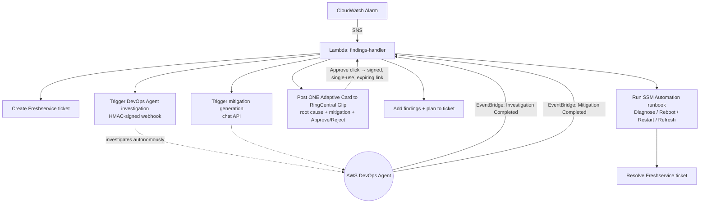

# Automated Incident Response — AWS DevOps Agent → RingCentral → Freshservice

A serverless pipeline that turns a CloudWatch alarm into an autonomously
investigated, human-approved, auto-remediated incident — end to end, with a
single approval card in chat.

When an alarm fires, the system opens a Freshservice ticket, triggers an **AWS
DevOps Agent** investigation, waits for the real root-cause analysis, asks the
Agent to generate a mitigation plan, and posts **one consolidated Adaptive Card**
to **RingCentral Glip** with the root cause, the proposed mitigation, and
Approve / Reject buttons. On approval, it runs an **SSM Automation runbook** to
remediate, then resolves the ticket.

> Built as a single self-contained AWS SAM stack (one Lambda + its own SNS topic,
> SSM runbook, IAM role, and Secrets Manager secret). No servers, no Step
> Functions, no external state store.

## Architecture



## What it demonstrates

- **Event-driven serverless design** — a single Lambda dispatching across SNS,
  EventBridge lifecycle events, and a public Function URL, with all state in SSM
  Parameter Store (no database).
- **Third-party AI-agent integration** — triggering and retrieving results from
  the AWS DevOps Agent via HMAC-signed webhooks, journal-record reads, and a
  streaming chat API.
- **Human-in-the-loop automation** — chat-based approval gating a real
  infrastructure action, with safety guardrails.
- **Secure-by-design** — secrets in Secrets Manager (never in code), HMAC-signed
  approval links that are single-use and time-limited, least-privilege-oriented
  IAM, and an opt-in resource tag guardrail for destructive actions.

## Engineering challenges solved

- **HMAC webhook signing** — the DevOps Agent rejects requests unless the
  signature is computed over `"{ISO-8601-timestamp-with-real-ms}:{body}"`;
  getting the millisecond format exactly right was the difference between 200 and
  403.
- **Two-phase mitigation retrieval** — mitigation is *not* auto-generated; it's an
  opt-in step. The pipeline triggers generation via the Agent's chat API on
  `Investigation Completed`, then fetches the plan on `Mitigation Completed`,
  decoding a streamed `contentBlockDelta` event stream.
- **Single consolidated card** — because chat webhooks can't edit a prior message,
  the card is deferred until the mitigation is ready so the whole incident lands
  in exactly one notification.
- **Single-use, expiring approvals** — approval links carry a signed expiry and are
  claimed atomically via an SSM `Overwrite=false` compare-and-set, so a link can't
  run the runbook twice or after it expires.
- **Safe-by-default remediation mapping** — the approver is offered specific
  actions parsed from the mitigation text (reboot / restart / refresh), but only
  when both an action verb and a concrete target are found and no negation is
  present; otherwise it falls back to read-only Diagnose.

## Tech

AWS Lambda · SNS · EventBridge · SSM Automation · Secrets Manager · CloudFormation
/ SAM · AWS DevOps Agent · RingCentral Glip · Freshservice · Python (stdlib +
boto3 only).

## Deploy

See [README.md](./README.md) for full deployment, parameters, testing, and the
SSM-vs-Kiro remediation notes. In short:

```bash
cp parameters.example.json parameters.json   # fill in your endpoints/keys
./deploy.sh my-stack-name
```

## Notes

This was built and validated against real AWS accounts. Credentials shown in any
examples are placeholders; real secrets live only in a gitignored
`parameters.json` and in AWS Secrets Manager. Remediation defaults to read-only
Diagnose mode; enabling real actions is a deliberate, guardrailed opt-in.
